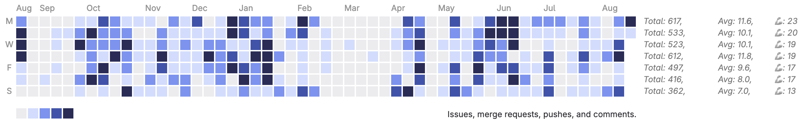

  

# gitlab-contribution-summary
Firefox add-on that shows a user's contribution summary in their Gitlab profile

Install it as a temporary extension in `about:debugging#/runtime/this-firefox` section and reload user's Gitlab profile tab if it's already open

__Warning!__ Only works for the English localized Gitlab interface. But feel free to modify it to add i18n!
